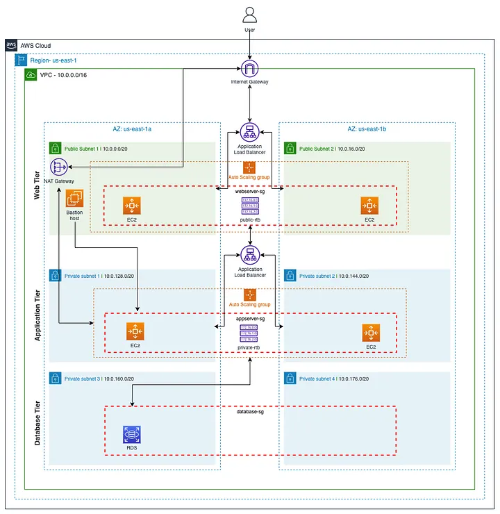

# Terraform AWS 3-Tier Architecture


## 1. Introduction

This repository contains a fully automated deployment of a 3-tier architecture on AWS using Terraform and three environnements : dev, stagging, prod. 

 The setup implements industry best practices for scalability, security, and maintainability.

The architecture includes:
- Segmented VPC architecture (web, application, and database tiers)
- High availability across multiple Availability Zones
- Auto Scaling Groups and Load Balancers
- RDS MySQL Multi-AZ support

---

## 2. Architecture Overview

### Components
- **Networking Layer**: VPC, subnets, NAT Gateway, Internet Gateway, route tables
- **Security**: Fine-grained Security Groups separating each tier
- **Web Tier**: Public ALB, EC2 Auto Scaling Group
- **Application Tier**: Internal ALB, EC2 Auto Scaling Group
- **Database Tier**: RDS MySQL with subnet groups

---

## 3. Architecture Overview

<p align="center">
  
</p>


## 4. Benefits of This Architecture

###  Scalability
- Auto Scaling Groups adjust compute capacity automatically.
- Load Balancers distribute traffic across multiple AZs.

###  Security
- Public exposure limited strictly to the ALB.
- Application and database tiers live entirely in private networks.

###  High Availability
- All tiers span multiple Availability Zones.
- RDS Multi-AZ enhances database resilience.

###  Best Practices
- Modular, readable Terraform code structure
- Tier-isolated subnets
- Principle of least privilege enforced through SG rules

---


## 5. How to Use This Project

### 1. Install Requirements
- Terraform ≥ **1.6**
- AWS CLI ≥ **2.0**
- IAM credentials with appropriate permissions

### 2. Configure AWS CLI
```bash
aws configure --profile <your-profile>
```

### 3. Clone the Repository
```bash
git clone https://github.com/<your-username>/terraform-aws-3tier.git
cd terraform-aws-3tier
```

### 4. Prepare your variables
```bash
cp terraform.tfvars.example terraform.tfvars
```
Update:
- aws_region
- aws_profile
- key_pair_name
- AMI IDs
- db_password

### 5. Initialize Terraform
```bash
terraform init
```

### 6. Validate
```bash
terraform validate
```

### 7. Apply
```bash
terraform apply
```

### 8. Destroy
```bash
terraform destroy
```
---

## 7. Project Description (for GitHub)
**A complete Terraform deployment of a production-grade 3-tier architecture on AWS**, featuring:
- Highly available VPC architecture across multiple AZs
- Web, application, and database tiers with strict isolation
- Auto Scaling EC2 workloads
- Public and internal Load Balancers
- RDS MySQL with Multi-AZ capabilities

---

## 9. References
- Terraform Documentation: https://developer.hashicorp.com/terraform/docs
- AWS Well-Architected Framework: https://aws.amazon.com/architecture/well-architected/
- AWS VPC Docs: https://docs.aws.amazon.com/vpc/latest/userguide
- AWS ELB Docs: https://docs.aws.amazon.com/elasticloadbalancing/latest/application
- AWS RDS Docs: https://docs.aws.amazon.com/rds


