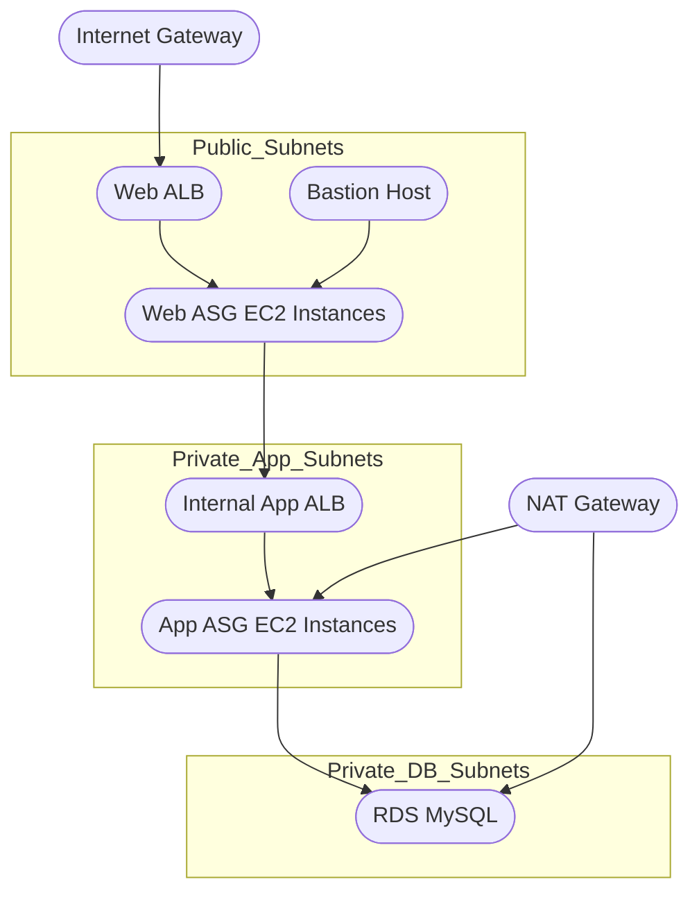

# Terraform AWS 3-Tier Architecture


## 1. Introduction
This repository contains a fully automated deployment of a 3-tier architecture on AWS using Terraform. It is ideal for learning, demonstration, or building production-grade infrastructures. The setup implements industry best practices for scalability, security, and maintainability.

The architecture includes:
- Segmented VPC architecture (web, application, and database tiers)
- High availability across multiple Availability Zones
- Bastion host for secure access
- Auto Scaling Groups and Load Balancers
- RDS MySQL Multi-AZ support

---

## 2. Architecture Overview

### Components
- **Networking Layer**: VPC, subnets, NAT Gateway, Internet Gateway, route tables
- **Security**: Fine-grained Security Groups separating each tier
- **Web Tier**: Public ALB, EC2 Auto Scaling Group
- **Application Tier**: Internal ALB, EC2 Auto Scaling Group
- **Database Tier**: RDS MySQL with subnet groups
- **Access Layer**: Bastion host with restricted SSH

---

## 3. Architecture Diagram (Mermaid)


---

## 4. Benefits of This Architecture

###  Scalability
- Auto Scaling Groups adjust compute capacity automatically.
- Load Balancers distribute traffic across multiple AZs.

###  Security
- Public exposure limited strictly to the ALB.
- Application and database tiers live entirely in private networks.
- Bastion host provides controlled SSH entry.

###  High Availability
- All tiers span multiple Availability Zones.
- RDS Multi-AZ enhances database resilience.

###  Best Practices
- Modular, readable Terraform code structure
- Tier-isolated subnets
- Principle of least privilege enforced through SG rules

---

## 5. Repository Structure
```
.
├── main.tf
├── provider.tf
├── variables.tf
├── outputs.tf
├── vpc.tf
├── subnets.tf
├── nat_igw.tf
├── security_groups.tf
├── alb.tf
├── asg_web.tf
├── asg_app.tf
├── rds.tf
├── bastion.tf
├── terraform.tfvars.example
└── README.md
```

---

## 6. How to Use This Project

### 1. Install Requirements
- Terraform ≥ **1.6**
- AWS CLI ≥ **2.0**
- IAM credentials with appropriate permissions

### 2. Configure AWS CLI
```bash
aws configure --profile <your-profile>
```

### 3. Clone the Repository
```bash
git clone https://github.com/<your-username>/terraform-aws-3tier.git
cd terraform-aws-3tier
```

### 4. Prepare your variables
```bash
cp terraform.tfvars.example terraform.tfvars
```
Update:
- aws_region
- aws_profile
- key_pair_name
- AMI IDs
- db_password

### 5. Initialize Terraform
```bash
terraform init
```

### 6. Validate
```bash
terraform validate
```

### 7. Apply
```bash
terraform apply
```

### 8. Destroy
```bash
terraform destroy
```

---

## 7. Project Description (for GitHub)
**A complete Terraform deployment of a production-grade 3-tier architecture on AWS**, featuring:
- Highly available VPC architecture across multiple AZs
- Web, application, and database tiers with strict isolation
- Bastion host for secure SSH access
- Auto Scaling EC2 workloads
- Public and internal Load Balancers
- RDS MySQL with Multi-AZ capabilities

Ideal for learning, DevOps portfolios, POCs, and real-world deployments.

---

## 8. Clean Commit History (Suggested)
```
feat: initial project structure
feat: add VPC and subnet definitions
feat: implement IGW, NAT, and route tables
feat: add security groups for all tiers
feat: create public web ALB and web ASG
feat: create private app ALB and app ASG
feat: implement RDS MySQL database
feat: add bastion host
docs: create complete README with diagrams and badges
refactor: improve variable descriptions and structure
```

---

## 9. References
- Terraform Documentation: https://developer.hashicorp.com/terraform/docs
- AWS Well-Architected Framework: https://aws.amazon.com/architecture/well-architected/
- AWS VPC Docs: https://docs.aws.amazon.com/vpc/latest/userguide
- AWS ELB Docs: https://docs.aws.amazon.com/elasticloadbalancing/latest/application
- AWS RDS Docs: https://docs.aws.amazon.com/rds

---

## 10. License
MIT License

